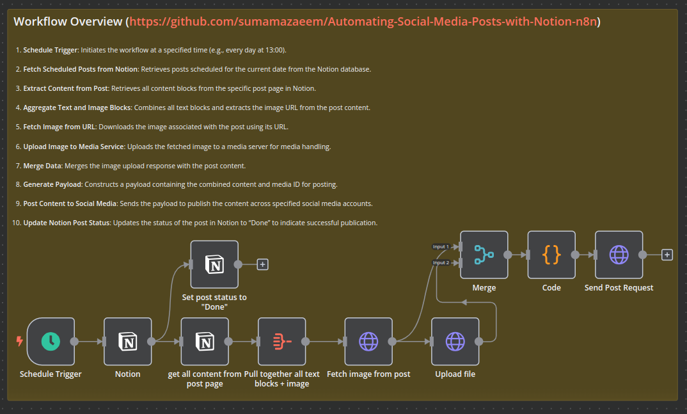

## Automating Social Media Posts with Notion & n8n: A Comprehensive Workflow

In this article, we'll walk you through an automated workflow created using n8n, an open-source workflow automation tool. This workflow fetches scheduled posts from Notion, processes the content, uploads necessary media, and posts the content to multiple social media platforms(Facebook, Twitter, LinkedIn, twitter, youtube and Tiktok). Additionally, it updates the status of the post in Notion to indicate that it has been successfully published. Let's dive into each step of the workflow.

Our setup involves hosting the n8n community edition as Docker container on a self hosted Coolify on ec2 instances.

### Step 1: Schedule Trigger

The workflow starts with a **Schedule Trigger**, which initiates the process at a predetermined time every day. This ensures that the workflow runs automatically without any manual intervention, fetching the content to be posted for the day.

### Step 2: Fetch Data from Notion

Next, a **Notion Node** is used to fetch data from a Notion database. This database contains all the posts scheduled for the day. The node retrieves all pages from the Notion database that have a date matching the current day. This allows the workflow to identify which posts need to be published.

### Step 3: Fetch Content from Notion Page

Once the relevant posts are identified, the **Get All Content from Post Page** node fetches all content blocks from each Notion page. This includes text, images, and other media types. The retrieved content is then prepared for aggregation.

### Step 4: Aggregate Content

The **Pull Together All Text Blocks + Image** node aggregates the fetched content. This node combines all text blocks into a single content block and ensures that any associated images are included. This aggregated content forms the main body of the social media post.

### Step 5: Fetch Image from Post

The **Fetch Image from Post** node extracts the image URL from the aggregated content. This URL is used to fetch the image file that will be uploaded to the media service.

### Step 6: Upload Image

The **Upload File** node handles the image upload. It sends a POST request to an external media service, uploading the image file and receiving a media ID in response. This media ID is crucial for attaching the image to the social media post.

### Step 7: Merge Data

The **Merge** node combines the data from the previous steps, including the aggregated content and the media ID from the image upload. This merged data is used to prepare the final payload for the social media post.

### Step 8: Prepare Payload with Code Node

A **Code Node** constructs the payload for the social media post. This node extracts the necessary data, such as the media ID and combined content, and formats it into the required structure for the API request. The payload includes details like the posting date, time, timezone, and content to be posted, along with the media ID.

### Step 9: Send Post Request

The **Send Post Request** node sends a POST request to the social media platform's API with the prepared payload. This ensures that the content is posted to all specified social media accounts at the scheduled time.

### Step 10: Update Post Status in Notion

Finally, the **Set Post Status to "Done"** node updates the status of the post in Notion to "Done." This marks the post as published, providing a clear indication that the workflow has successfully completed its task.

## Conclusion

This automated workflow demonstrates the powerful capabilities of n8n in integrating various services and automating complex processes. By fetching content from Notion, aggregating it, uploading media, and posting it to social media platforms, this workflow reduces manual effort and ensures timely and accurate social media engagement. Whether you're managing a personal blog or handling multiple social Media Accounts, automating your content workflow with n8n can significantly enhance productivity and streamline your operations.

### What's Next

1. Adding integration of OPENAI and other GenAI platforms.
2. Implementing advanced analytics and reporting features to monitor the performance of social media posts.
3. Incorporating more advanced content generation techniques, such as using AI for automatic content creation and optimization.
4. Exploring additional automation for scheduling and targeting specific audiences across different platforms.
5. Enhancing error handling and notifications to promptly address issues in the workflow.